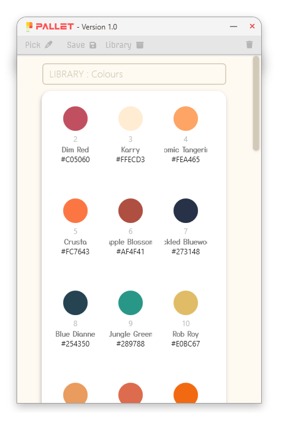
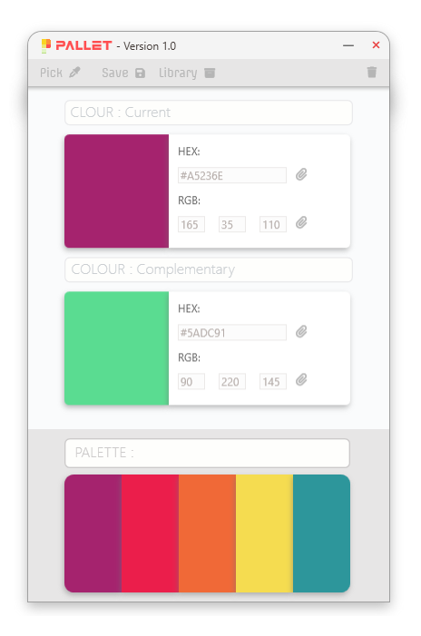
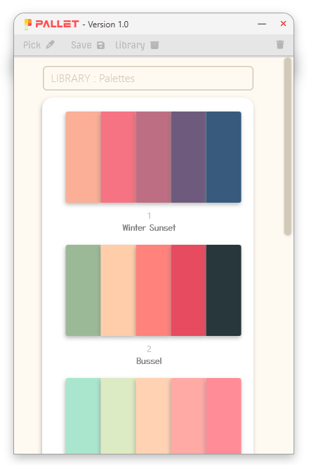
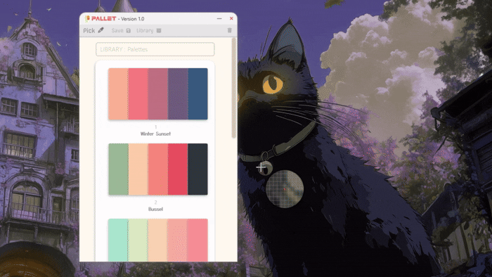
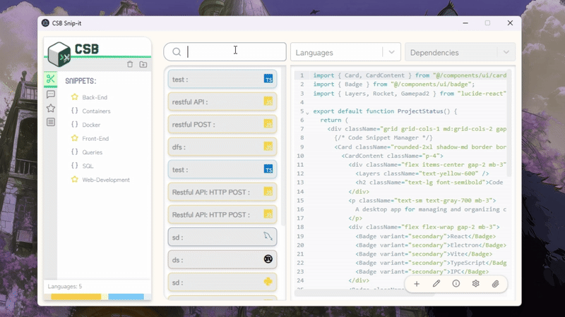
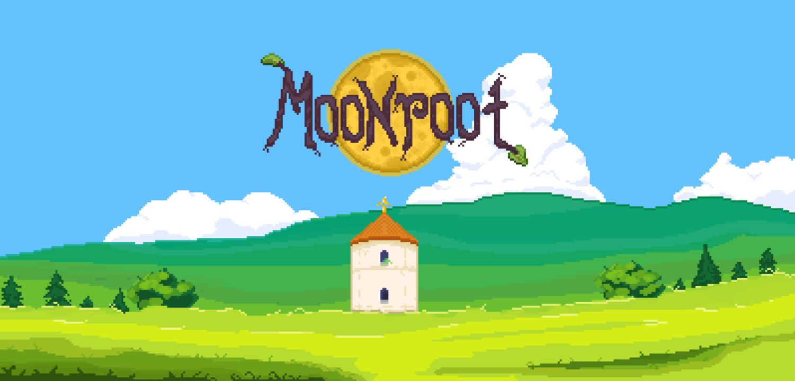

  
  
  

  
     
  

---

# Hi, I'm Luke 👋  
Welcome to my GitHub!

## About Me
I’m passionate about programming, technology, and creativity. Outside of coding, I enjoy:  

- **Painting:** Oil and acrylic  
- **Digital art**  
- **3D printing**  
- **Computer building:** Especially ITX builds  
- **Miniature painting:** Tabletop models  

I also enjoy exploring:  

- **Linux customization (ricing)**  
- **Microprocessors:** Raspberry Pi and Arduino projects  

## My Ambitions
I aim to combine my interests in **3D printing** and **microprocessor programming** to create technology that interacts with sensors and the physical world.  

I love learning, experimenting, and building projects that merge software and hardware in creative ways.

---

### :hammer_and_wrench: Languages and Tools :

  <h3> Most Proficient: </h3>
    
   
   
   
   
  
  
   
  
  <h3> Moderate: </h3>
  
  
  
  
  
  
  
   
  
  <h3> Used Before: </h3>
  
  
  
  

---

## 🚀 Recent Project

### 🎨 Palet Color Picker (WPF)

A desktop application built with **WPF** (Windows Presentation Foundation) that allows users to quickly pick and manage colors, similar to the Windows Snipping Tool.  

- **Backend:** C#  
- **Framework:** WPF  
- **Features:**  
  - Capture colors from anywhere on the screen  
  - Store favorite colors for quick access  
  - Simple, intuitive UI  

**Status:** Actively developed and functional as a proof of concept (there are bugs).  

## 🚀 Current Projects

## 🔧 Code Snippet Manager

A desktop application for managing and organizing code snippets efficiently.  
Built with a modern and lightweight stack (not lightweight to be honest but modern is true):  

- **React + Vite** for a fast, responsive UI  
- **Electron** to deliver a cross-platform desktop app  
- **TypeScript** for backend classes and methods that interact with the JSON database  
- **IPC (Inter-Process Communication)** bridges TypeScript logic → compiled JavaScript → React renderer/UI  

**Status:** Incomplete but close to a functional first release 🚧  

---

## 🌙 Moon Root

An indie top-down pixel ARPG inspired by life sims, ARPG and rogue like games. we aim to create a melting pot of these genres to create a fresh experience for players looking to venture or even cross over into these genres:  

- Choosing dungeons to grind  
- Leveling diverse skills  
- Exploring and unlocking new areas  

Core features in development include:  
- Dynamic **day/night cycles**  
- Environmental effects such as **rain and weather changes**  
- Rich pixel art style
- Dungeons
- World Bosses
- End Game Areana
- RNG Loot role out mixed with farmable loot

**Development:**  
- **Team size:** 2  
  - I’m responsible for all art and sprites (world tiles, NPCs, mobs, animations, etc.), Core Game Functionality Programming, UI and UX design  
  - My partner handles game development, systems, and mechanics, mob mechanics, boss and dungeon design.  
- **Status:** Early development 🌱

---

## 🚀 Next Projects 
**(my next two projects lined up after i finish CBS)**
- Compiler in GO language (i want to learn go so i thought  this would be a great introduction :) )
- Remaster of my palet colour picker in a more lightweight language, maybe ill write it from scratch in c or something idk.

